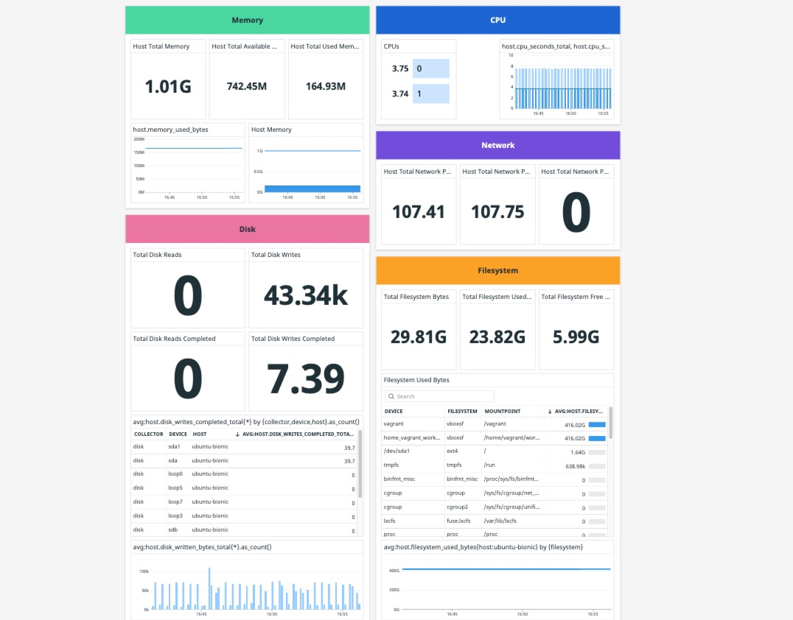

# Vector-Datadog
Samples of Host Metrics Collection with Vector


## Vector Host Metrics

Show metrics collected from hosts via Vector. To get started with Vector metrics collection proceed to the following:

* Install Vector in your host via [cURL](https://vector.dev/docs/setup/installation/#installation-script)
* Create a Vector TOML config file `host_metrics.toml`
* Execute the collection with `$ vector --config host_metrics.toml`

### TOM Config Simplified Sample

The current TOML consists of a Vector `source` and `sink` only. To expand transformation capabilities see [Vector Metrics](https://vector.dev/docs/about/under-the-hood/architecture/data-model/metric/)

> file: `host_metrics.toml`

```yaml
[sources.my_source_id]
type = "host_metrics"
collectors = [ "cpu","memory","disk","network","filesystem" ]
scrape_interval_secs = 15

[sinks.my_sink_id]
type = "datadog_metrics"
inputs = [ "my_source_id" ]
api_key = "${DD-API-KEY}"
default_namespace = "service"
```



### Datadog Dashboard

* Download the JSON file [Vector - Host Metrics](Vector-HostMetrics--2021-11-04T19_22_56.json)
* Import the JSON file into Datadog via the new dashboard process and accept the overwrite changes.
